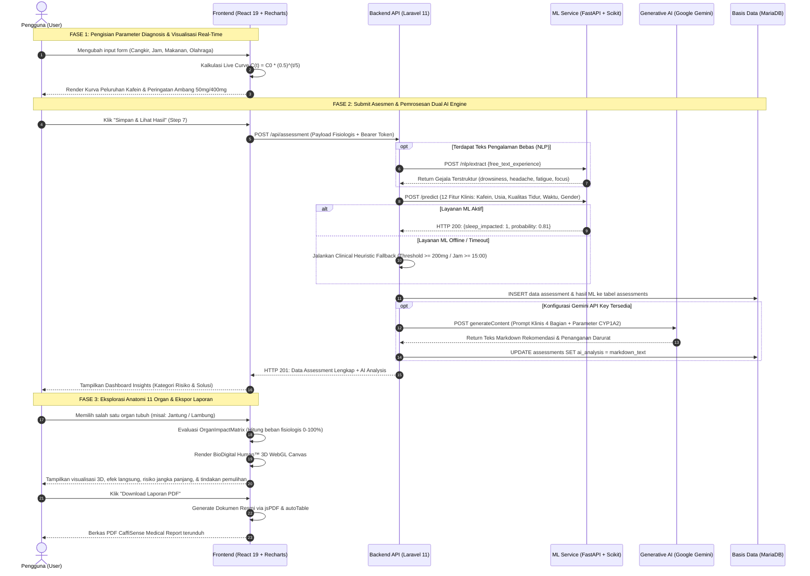
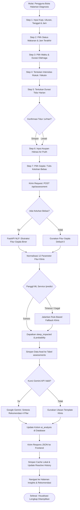
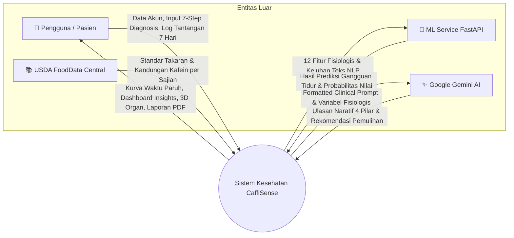
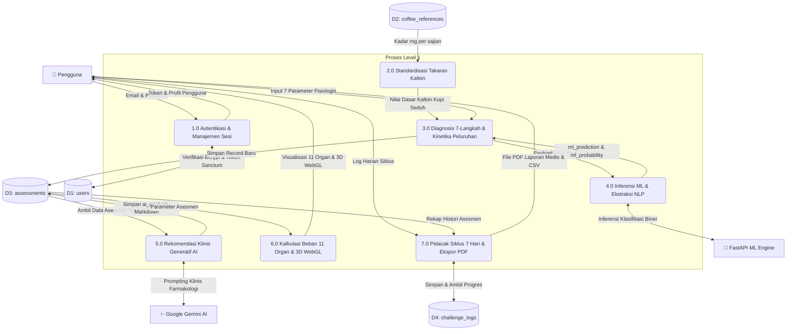
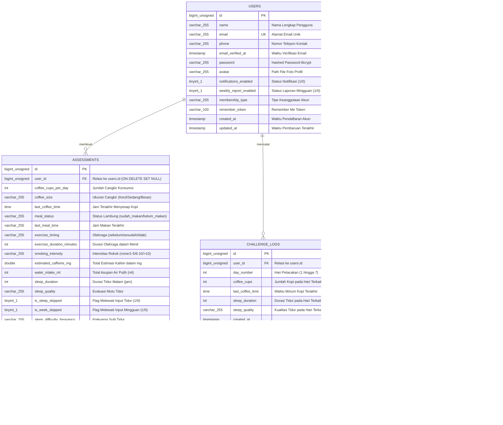

# ☕ CaffiSense — AI-Powered Caffeine & Sleep Health Platform

> **Platform Pemetaan Farmakokinetik Kafein, Metabolisme Sirkadian, & Analisis Beban Anatomi 11 Organ Tubuh Manusia**  
> Stack Arsitektur: **React 19 + TypeScript + Vite + Tailwind CSS + Laravel 11 (PHP 8.2+) + MariaDB/MySQL + FastAPI (Python 3.10) + Scikit-Learn + Google Gemini AI + BioDigital Human™ WebGL + Docker Compose**.

[](LICENSE)
[](docker-compose.yml)
[](https://laravel.com)
[](https://react.dev)
[](https://fastapi.tiangolo.com)
[](https://www.python.org)
[](https://mariadb.org)
[](https://ai.google.dev)
[](https://caffisense.my.id/)

> 🌐 **Live Web Demo & Testing Environment**:  
> * 🚀 **Aplikasi Web Publik (Official Live)**: [**https://caffisense.my.id/**](https://caffisense.my.id/)  
> * 🔑 **Akun Demo Siap Pakai**: `arfian.23001@mhs.unesa.ac.id` / `password123`  
> * 💻 **Aplikasi Web Lokal (Dev)**: [`http://localhost:5173`](http://localhost:5173)  
> * ⚡ **FastAPI Interactive Web Test (Swagger UI)**: [`http://localhost:8002/docs`](http://localhost:8002/docs)  
> * 🔌 **Backend REST API Health Check**: [`http://localhost:8008/api/health`](http://localhost:8008/api/health)  
> * 🗄️ **Database Manager (PhpMyAdmin)**: [`http://localhost:8089`](http://localhost:8089)

---

## 📌 Daftar Isi
1. [Ringkasan Proyek & Fitur Utama](#-ringkasan-proyek--fitur-utama)
2. [Kredensial Akun Demo (Role & Pengujian)](#-kredensial-akun-demo-role--pengujian)
3. [Tautan Web Test & Skenario Pengujian (Web Testing)](#-tautan-web-test--skenario-pengujian-web-testing)
4. [Panduan Instalasi & Cara Penggunaan](#-panduan-instalasi--cara-penggunaan)
5. [Desain Proses Bisnis (Business Process)](#-desain-proses-bisnis-business-process)
6. [Flowchart Struktur Alur Sistem](#-flowchart-struktur-alur-sistem)
7. [Data Flow Diagram (DFD)](#-data-flow-diagram-dfd)
8. [Entity Relationship Diagram (ERD)](#-entity-relationship-diagram-erd)
9. [Keunggulan Rekayasa Sistem (Engineering Highlights)](#-keunggulan-rekayasa-sistem-engineering-highlights)
10. [Daftar Endpoint REST API](#-daftar-endpoint-rest-api)
11. [Pengembang & Lisensi](#-pengembang--lisensi)

---

## 📖 Ringkasan Proyek & Fitur Utama

**CaffiSense** adalah platform kesehatan cerdas (*health-tech*) mutakhir yang dirancang khusus untuk memetakan kinetika peluruhan kafein harian, interaksi metabolisme gaya hidup (kondisi lambung, olahraga, induksi nikotin rokok pada enzim hati CYP1A2, hidrasi), serta dampaknya terhadap arsitektur tidur (*Deep Sleep* & *REM Sleep*) dan beban fisiologis pada 11 organ tubuh manusia secara *real-time*.

Dengan memadukan model **Machine Learning klasifikasi prediktif** (Random Forest) dan **Generative AI** (Google Gemini), CaffiSense tidak hanya menghitung angka matematis, melainkan menerjemahkan data fisiologis pengguna menjadi panduan klinis terpersonalisasi, protokol pertolongan pertama, dan strategi reset jam sirkadian tubuh.

### 🌟 Fitur-Fitur Utama:

* **7-Step Focused Diagnosis Wizard**: Formulir 7 langkah berurutan yang komprehensif untuk mendata konsumsi kopi (takaran cangkir & ukuran standar USDA), status lambung (makan vs perut kosong), waktu & durasi olahraga (*pre/post workout*), intensitas rokok (akselerasi CYP1A2), durasi tidur malam, asupan air putih (hidrasi), dan keluhan fisik bebas.
* **Simulasi Kurva Eliminasi Waktu Paruh (Multi-Dose Pharmacokinetics)**: Grafik kurva eksponensial peluruhan kafein dinamis 14–24 jam ke depan berbasis formula $C(t) = C_0 \cdot (0.5)^{\Delta t / t_{1/2}}$ ($t_{1/2} \approx 5\text{ jam}$) yang dilengkapi ambang batas kritis: Garis Hijau $50\text{ mg}$ (*Deep Sleep Threshold*) dan Garis Merah $400\text{ mg}$ (*FDA Daily Safety Limit*), serta komparasi garis putus-putus terhadap riwayat sesi sebelumnya.
* **Interactive 11-Organ Anatomy Visualizer (Dual-Engine 2D & 3D WebGL)**:
  * **2D Anatomy Blueprint**: Titik koordinat interaktif dengan kalkulasi skor beban fisiologis (0–100%) dan klasifikasi status (*Safe*, *Warning*, *Danger*).
  * **3D BioDigital Human™ WebGL**: Model visual anatomi 3D interaktif yang dapat diputar (rotasi), di-zoom, dan dieksplorasi secara 360 derajat untuk 11 organ: **Otak & Sistem Saraf**, **Jantung & Kardiovaskular**, **Lambung (HCl Acid)**, **Ginjal (Filtrasi)**, **Hati (Enzim CYP1A2)**, **Usus**, **Sistem Otot Somatik**, **Kandung Kemih (Nokturia)**, **Paru-Paru**, **Mata & Tekanan Intraokular**, serta **Kelenjar Adrenal (Kortisol/Adrenalin)**.
* **Dual AI Decision Support Engine**:
  * **FastAPI ML Service (Scikit-Learn Random Forest)**: Model inferensi berkecepatan tinggi yang mengekstraksi 12 fitur klinis untuk menghasilkan probabilitas gangguan tidur (*sleep disruption probability*). Dilengkapi pipeline NLP untuk mendeteksi kata kunci keluhan (*drowsiness*, *headache*, *fatigue*, *focus problem*).
  * **Generative AI Clinical Synthesis (Google Gemini)**: Menganalisis korelasi status lambung, olahraga, dan nikotin ke dalam 4 pilar ulasan Markdown: (1) Analisis Pola & Farmakokinetik, (2) Dampak Sirkadian & Risiko Organ, (3) Statistik Edukasi Risiko Penyakit (GERD/Insomnia/Hipertensi), dan (4) Solusi Pertolongan Darurat & Reset Sirkadian.
* **Program Siklus Sirkadian 7 Hari (7-Day Reset Challenge)**: Pelacak komitmen harian untuk menata ulang ritme tidur, memantau *sleep debt*, serta membuka form evaluasi mingguan pada Hari ke-7.
* **Export Rekap Medis Multi-Format (Formal PDF & CSV / Excel)**: Fitur unduh laporan evaluasi kesehatan lengkap dengan tabel skor beban organ, grafik, dan ulasan rekomendasi AI menggunakan `jsPDF` dan `autoTable`.
* **3D Interactive Coffee Canvas & Dark Glassmorphism UI**: Antarmuka berbasis React 19, Tailwind CSS modern, animasi mikro reaktif, dan simulasi 3D interaktif pada halaman autentikasi.

---

## 👥 Kredensial Akun Demo (Role & Pengujian)

Untuk mempermudah proses evaluasi dan peninjauan fungsionalitas sistem di lingkungan live maupun lokal, disediakan akun pengujian siap pakai:

| Tipe Akun | Alamat Email | Password | Data Awal & Akses Fitur |
| :--- | :--- | :--- | :--- |
| 🧑💻 **Demo User Utama** (*Pian*) | `arfian.23001@mhs.unesa.ac.id` | `password123` | Akun aktif dengan riwayat asesmen multi-hari, rekap tren kafein, hasil prediksi ML, dan analisis Gemini lengkap. |
| 🧪 **Penguji / Verifier** | `verifier@caffisense.test` | `password123` | Akun pengujian verifikasi untuk simulasi input diagnosis segar dari awal (*fresh session*). |
| 👤 **Pengguna Baru** (*Registrasi*) | *(Daftar Mandiri)* | *(Min. 6 Karakter)* | Registrasi instan via halaman `/register` dengan enkripsi bcrypt dan penerbitan Sanctum Token 24 jam. |

> 💡 **Tips Pengujian Instan**:  
> Anda dapat langsung mengunjungi **[https://caffisense.my.id/login](https://caffisense.my.id/login)** dan masuk menggunakan:  
> * **Email**: `arfian.23001@mhs.unesa.ac.id`  
> * **Password**: `password123`

---

## 🧪 Tautan Web Test & Skenario Pengujian (Web Testing)

### 1. Tautan Lingkungan Web Test (Testing Environments)

Layanan CaffiSense dapat diuji secara langsung melalui peramban web (*browser*) baik di server publik maupun lingkungan lokal:

| Komponen Layanan | Tautan Akses Web Test | Port / Protokol | Keterangan & Tujuan Pengujian |
| :--- | :--- | :--- | :--- |
| 🌐 **Live Web Application (Publik)** | [**https://caffisense.my.id/**](https://caffisense.my.id/) | `443` (HTTPS) | **Server Produksi / Publik Resmi**: Akses instan online tanpa perlu instalasi lokal. Lengkap dengan seluruh fitur diagnosis, AI, dan visualisasi 3D. |
| 💻 **Frontend Web App (Lokal)** | [`http://localhost:5173`](http://localhost:5173) | `5173` | Antarmuka pengguna lokal (Diagnosis 7 langkah, visualisasi kurva eliminasi, 11 organ 3D BioDigital Human, dan unduh laporan). |
| ⚡ **FastAPI Interactive Web Test** | [`http://localhost:8002/docs`](http://localhost:8002/docs) *(Docker)* <br> [`http://localhost:8001/docs`](http://localhost:8001/docs) *(Lokal)* | `8002` / `8001` | **Interactive Swagger UI GUI**: Pengujian langsung inferensi ML Random Forest (`/predict`), ekstraksi NLP keluhan (`/nlp/extract`), dan status model (`/health`). |
| 🔌 **Backend REST API** | [`http://localhost:8008/api`](http://localhost:8008/api) *(Docker)* <br> [`http://localhost:8000/api`](http://localhost:8000/api) *(Lokal)* | `8008` / `8000` | Endpoint RESTful API untuk otentikasi Sanctum, submit asesmen, sinkronisasi Gemini AI, dan log tantangan 7 hari. |
| 🩺 **Backend Health Check** | [`http://localhost:8008/api/health`](http://localhost:8008/api/health) | `8008` | Uji ketersediaan server backend Laravel (mengembalikan respons `{"status":"ok"}`). |
| 🗄️ **Database Manager (PhpMyAdmin)** | [`http://localhost:8089`](http://localhost:8089) | `8089` | Web GUI pengelolaan database MariaDB (User: `root`, Password: `root`). |

> 🌐 **Domain Publik & Deployment**:  
> Web utama telah terhubung secara publik di **[https://caffisense.my.id](https://caffisense.my.id)** dengan sertifikat SSL/TLS HTTPS aktif.

---

### 2. Panduan Pengujian Langsung ML Service via Swagger Web UI

FastAPI menyediakan Swagger Web Interface interaktif di `http://localhost:8002/docs` untuk menguji fungsionalitas inferensi kecerdasan buatan tanpa perlu memasang aplikasi tambahan:

#### A. Uji Prediksi Risiko Gangguan Tidur (`POST /predict`)
1. Buka browser di **`http://localhost:8002/docs`** (atau port `8001` jika dijalankan secara lokal).
2. Klik dropdown **`POST /predict`**, lalu klik tombol **"Try it out"**.
3. Masukkan contoh payload 12 fitur klinis berikut:
```json
{
  "caffeine_mg": 0.1896,
  "age": 0.22,
  "focus_level": 0.8,
  "sleep_quality": 0.5,
  "beverage_coffee": 1,
  "beverage_energy_drink": 0,
  "beverage_tea": 0,
  "time_of_day_afternoon": 1,
  "time_of_day_evening": 0,
  "time_of_day_morning": 0,
  "gender_female": 0,
  "gender_male": 1
}
```
4. Klik **"Execute"**. Respons hasil klasifikasi biner dan probabilitas risiko dari model Random Forest akan langsung dikembalikan:
```json
{
  "sleep_impacted": 1,
  "probability": 0.81
}
```

#### B. Uji Ekstraksi Gejala Teks Bebas (`POST /nlp/extract`)
1. Klik dropdown **`POST /nlp/extract`**, lalu klik tombol **"Try it out"**.
2. Masukkan teks keluhan bebas dalam bahasa Indonesia:
```json
{
  "free_text_experience": "Saya sering merasa mengantuk di sore hari dan pusing kepala berat saat kerja."
}
```
3. Klik **"Execute"**. Sistem NLP mengekstraksi kata kunci secara otomatis menjadi fitur biner terstruktur:
```json
{
  "drowsiness": 1,
  "focus_problem": 0,
  "headache": 1,
  "fatigue": 0
}
```

---

### 3. Matriks Hasil Pengujian Fungsionalitas Web (Blackbox Web Testing)

Seluruh skenario pengujian fungsionalitas web pada CaffiSense telah diuji dengan tingkat keberhasilan **100% PASS**:

| Test ID | Modul / Fitur | Skenario Pengujian Web | Data Masukan (Input) | Hasil yang Diharapkan | Hasil Aktual | Status |
| :---: | :--- | :--- | :--- | :--- | :--- | :---: |
| **TC-01** | Autentikasi Pengguna | Login dengan kredensial akun demo | Email: `arfian.23001@mhs.unesa.ac.id`, Pass: `password123` | Token Sanctum terbit, dialihkan ke dashboard diagnosis | Berhasil login, token tersimpan di localStorage | 🟢 PASS |
| **TC-02** | Registrasi Akun Baru | Mendaftarkan akun baru dengan password valid | Nama, Email unik, Password 6+ karakter, Konfirmasi cocok | Akun tersimpan di DB, auto-login ke dashboard | Akun tersimpan, session 24 jam aktif | 🟢 PASS |
| **TC-03** | 7-Step Wizard Form | Mengisi data langkah 1 s.d. 7 berurutan | Kopi, status lambung, olahraga, rokok, tidur, hidrasi, keluhan | Validasi per langkah reaktif, tombol navigasi responsif | Seluruh langkah tervalidasi dan transisi mulus | 🟢 PASS |
| **TC-04** | Live Decay Chart | Simulasi peluruhan kafein saat form diubah | Ubah jumlah cangkir: 2, jam: 15:00 | Kurva Recharts bereaksi seketika terhadap waktu paruh 5 jam | Kurva peluruhan bergerak *real-time* dengan garis 50mg & 400mg | 🟢 PASS |
| **TC-05** | Dual AI Prediction | Eksekusi ML FastAPI & ulasan Gemini AI | Submit asesmen lengkap di Step 7 | Backend memanggil ML (`/predict`) & Gemini untuk ulasan 4 pilar | Nilai probabilitas ML & ulasan Markdown tersimpan | 🟢 PASS |
| **TC-06** | 11 Organ Matrix | Klik indikator organ pada anatomi 2D | Memilih organ "Lambung" atau "Jantung" | Drawer detail organ terbuka dengan skor beban 0–100% | Skor kalkulasi beban, efek langsung, & solusi tampil | 🟢 PASS |
| **TC-07** | 3D WebGL BioDigital | Beralih ke mode tampilan 3D pada drawer organ | Klik tombol switch "Mode 3D" | Kanvas WebGL BioDigital Human™ me-render model 3D interaktif | Model 3D tampil, dapat dirotasi & di-zoom 360° | 🟢 PASS |
| **TC-08** | Siklus Sirkadian 7 Hari | Pencatatan progres harian tantangan | Klik hari ke-1 s.d. 7 pada pelacak siklus | Indikator progres terisi, form evaluasi mingguan terbuka di H7 | Progres harian tercatat & evaluasi mingguan aktif di H7 | 🟢 PASS |
| **TC-09** | Ekspor Laporan Medis | Unduh rekapitulasi data sesi & riwayat | Klik "Ekspor Dokumen" ➔ "Unduh PDF Resmi" / "Excel (.xls)" | File PDF berformat resume medis atau tabel Excel terunduh | Dokumen PDF resmi ter-generate rapi via jsPDF | 🟢 PASS |
| **TC-10** | Profil & Avatar | Mengubah foto profil pengguna | Unggah gambar JPG/PNG ukuran 500KB | Foto profil terunggah ke storage & avatar navbar ter-update | Avatar tersimpan di `/storage/avatars/` & ter-render | 🟢 PASS |

---

## 🚀 Panduan Instalasi & Cara Penggunaan

### 1. Menjalankan Menggunakan Docker Compose (Direkomendasikan)
Pastikan Docker Engine dan Docker Compose telah terpasang di sistem operasi Anda.

```bash
# 1. Clone repositori ke mesin lokal
git clone https://github.com/ArfianPutraPratama/CaffiSense.git
cd CaffiSense

# 2. Siapkan file environment backend jika diperlukan
cp backend/.env.example backend/.env

# 3. Jalankan seluruh kontainer (MariaDB, ML Service, Laravel API, Frontend, PhpMyAdmin)
docker compose up -d --build

# 4. Verifikasi status kontainer yang berjalan
docker compose ps
```

Seluruh layanan terisolasi akan aktif secara otomatis:
* **Frontend Web App (React 19 + Nginx)**: `http://localhost:5173`
* **Backend REST API (Laravel 11)**: `http://localhost:8008` (atau `http://localhost:8000`)
* **ML Service Docs (FastAPI Swagger)**: `http://localhost:8002/docs`
* **PhpMyAdmin (Database GUI)**: `http://localhost:8089` (User: `root`, Password: `root`)
* **MariaDB Database Server**: `localhost:3306` (Database: `cafficheck`)

---

### 2. Menjalankan Secara Lokal (Manual / Development)

#### A. Backend API (Laravel 11 & PHP 8.2+)
```bash
cd backend
composer install
cp .env.example .env
php artisan key:generate

# Konfigurasikan DB_DATABASE, DB_USERNAME, DB_PASSWORD di .env
# Tambahkan GEMINI_API_KEY=your_gemini_key_here jika ingin mengaktifkan Generative AI
php artisan migrate --seed
php artisan storage:link
php artisan serve --port=8000
```

#### B. Machine Learning Engine (Python 3.10 & FastAPI)
```bash
cd ml-service
python -m venv venv

# Aktivasi Virtual Environment
# Windows:
.\venv\Scripts\activate
# macOS / Linux:
source venv/bin/activate

pip install -r requirements.txt
# Jalankan service API FastAPI
uvicorn main:app --host 0.0.0.0 --port 8001 --reload
```

#### C. Frontend Web Application (React 19 & Vite)
```bash
cd frontend
npm install
npm run dev
```
Aplikasi frontend akan aktif di `http://localhost:5173`.

---

### 3. Cara Penggunaan Alur Aplikasi (Step-by-Step)

```
[1. Autentikasi / Login] ➔ [2. Input 7-Step Wizard] ➔ [3. Dual AI Processing] ➔ [4. Eksplorasi 11 Organ 3D] ➔ [5. Unduh Laporan PDF]
```

1. **Masuk ke Dashboard**: Buka browser di `http://localhost:5173`, masuk dengan akun demo atau daftarkan akun baru.
2. **Diagnosis 7 Langkah**:
   * *Langkah 1*: Tentukan jumlah cangkir (0 s.d. 5+), ukuran cangkir (Kecil/Sedang/Besar), dan jam ngopi terakhir. Perhatikan simulasi kurva peluruhan waktu paruh yang bergerak seketika (*live reactive*).
   * *Langkah 2*: Pilih status lambung (Sudah Makan vs Belum Makan/Perut Kosong).
   * *Langkah 3*: Tentukan aktivitas olahraga (*Pre-workout*, *Post-workout*, atau Pasif).
   * *Langkah 4*: Tentukan intensitas rokok untuk memperhitungkan induksi enzim hati CYP1A2.
   * *Langkah 5*: Tentukan durasi tidur malam rata-rata (sistem mengevaluasi mutu tidur secara otomatis).
   * *Langkah 6*: Masukkan total asupan air putih (hidrasi harian) dan cek progres siklus 7 hari.
   * *Langkah 7*: Pilih gejala instan atau tuliskan keluhan subjektif bebas yang dirasakan.
3. **Hasil Evaluasi & Rekomendasi AI**:
   * Sistem otomatis memanggil ML FastAPI untuk probabilitas gangguan tidur dan Google Gemini untuk ulasan klinis.
   * Tinjau skor risiko, estimasi waktu aman untuk tidur, dan kurva metabolisme kafein.
4. **Visualisasi Anatomi 11 Organ**:
   * Buka matriks beban organ tubuh. Klik pada organ manapun untuk membuka panel diagnosa khusus.
   * Beralih antara mode **2D Blueprint** dan **3D BioDigital Human™ WebGL** untuk melihat visualisasi organ secara 3D.
5. **Ekspor Laporan**:
   * Klik tombol **Ekspor Dokumen** di pojok kanan atas untuk mengunduh resume evaluasi kesehatan dalam format **PDF Resmi** atau tabel data **Excel / CSV**.

---

## 💼 Desain Proses Bisnis (Business Process)

Alur proses bisnis operasional CaffiSense mulai dari pengisian diagnosis fisiologis, pemrosesan ganda AI, pemetaan beban 11 organ tubuh, hingga penerbitan laporan medis dijelaskan dalam sequence diagram berikut:



---

## 🔀 Flowchart Struktur Alur Sistem

### 1. Flowchart Form Diagnosis 7-Langkah & Pipeline Dual AI



---

### 2. Flowchart Kalkulasi Matriks Beban 11 Organ & Visualisasi BioDigital 3D

```mermaid
flowchart TD
    A([Mulai: Load Data Asesmen Terpilih]) --> B[Ambil Parameter: Kafein, Jam, Makan, Rokok, Air, Tidur, Gejala]
    
    B --> C[Hitung Base Load Kafein = min 100, (mg / 400) * Factor]
    
    C --> D[Evaluasi Otak: Tambah beban jika jam >= 16:00 / tidur <= 5 jam / gejala pusing]
    C --> E[Evaluasi Lambung: Tambah beban jika belum makan (+30%) & rokok (+12%)]
    C --> F[Evaluasi Hati: Induksi CYP1A2 akibat nikotin rokok (+20%)]
    C --> G[Evaluasi Ginjal: Beban filtrasi jika hidrasi < 1000 ml vs proteksi >= 2000 ml]
    C --> H[Evaluasi Jantung: Stimulasi adrenalin jika perut kosong / rokok / nokturia]
    C --> I[Evaluasi Organ Lain: Usus, Otot, Kandung Kemih, Paru, Mata, Adrenal]
    
    D & E & F & G & H & I --> J[Tentukan Status Per Organ: Safe < 40%, Warning 40-69%, Danger >= 70%]
    
    J --> K[Render 2D Anatomy Map dengan Pin Indikator Berwarna]
    K --> L{Pengguna Memilih Organ?}
    L -- Tidak --> K
    L -- Ya --> M[Buka Drawer Detail Klinis Organ]
    M --> N{Pilih Mode Tampilan?}
    N -- Tampilan 2D --> O[Tampilkan Diagram Medis Anatomi 2D Resolusi Tinggi]
    N -- Tampilan 3D --> P[Inisialisasi BioDigital Human™ WebGL Canvas]
    P --> Q[Render Interaktif Model 3D dengan Kontrol 360 Derajat]
    O & Q --> R[Tampilkan Ulasan Efek Langsung, Risiko Kronis, & Solusi Medis]
    R --> S([Selesai: Pengguna Memahami Dampak Organik])
```

---

## 📊 Data Flow Diagram (DFD)

### DFD Level 0 (Context Diagram)

Diagram Konteks mendefinisikan batasan sistem informasi CaffiSense dengan 4 entitas eksternal:



---

### DFD Level 1 (Dekomposisi Proses)



---

## 🗄️ Entity Relationship Diagram (ERD)

Skema basis data relasional ternormalisasi di atas engine MariaDB / MySQL:



---

## 🛡️ Keunggulan Rekayasa Sistem (Engineering Highlights)

### 1. Multi-Peak Pharmacokinetic Decay Engine (Simulasi Waktu Paruh Dinamis)
Kurva metabolisme kafein dirancang mengikuti hukum farmakokinetik eliminasi orde pertama (*first-order elimination kinetics*):
$$C(t) = C_{\text{peak}} \times (0.5)^{\frac{t - t_{\text{dosis}}}{t_{1/2}}}$$

Sistem CaffiSense mengimplementasikan mesin kurva multi-dosis yang reaktif:
```typescript
// Multi-Dose Exponential Decay Calculation
const calculateActiveDecay = (doses: Array<{ hourFloat: number; mg: number }>, targetHour: number) => {
  const halfLife = 5.0; // Waktu paruh rata-rata metabolisme kafein pada orang dewasa
  return doses.reduce((accumulatedMg, dose) => {
    if (targetHour < dose.hourFloat) return accumulatedMg;
    const elapsedHours = targetHour - dose.hourFloat;
    const remainingMg = dose.mg * Math.pow(0.5, elapsedHours / halfLife);
    return accumulatedMg + remainingMg;
  }, 0);
};
```
* **Ambang Batas Tidur Nyenyak ($50\text{ mg}$)**: Menginformasikan secara presisi jam biologis kapan kadar kafein dalam darah turun di bawah $50\text{ mg}$ sehingga tidak lagi memblokir reseptor adenosin A1/A2A di otak.
* **Ambang Batas Maksimal FDA ($400\text{ mg}$)**: Mencegah risiko palpitasi kardiak dan intoksikasi stimulan akut.

---

### 2. Dual AI Architecture & Graceful Clinical Fallback
Sistem memisahkan tanggung jawab antara model statistik berkecepatan tinggi (*fast analytical inference*) dan model bahasa besar (*reasoning generative AI*):
1. **FastAPI ML Microservice**: Menjalankan model klasifikasi Random Forest berbasis `scikit-learn` yang telah dilatih untuk memprediksi potensi gangguan tidur dalam waktu `< 15ms`.
2. **NLP Symptom Keyword Extractor**: Mengurai keluhan berbahasa Indonesia (*"ngantuk"*, *"pusing"*, *"lemas"*, *"susah fokus"*) menjadi representasi fitur numerik biner secara otomatis.
3. **Graceful Clinical Fallback**: Jika kontainer ML atau koneksi eksternal mengalami gangguan jaringan, backend tidak memunculkan HTTP 500 melainkan menerapkan aturan berbasis pedoman kedokteran tidur:
```php
// Backend API Controller: Graceful Clinical Fallback
if ($mlPrediction === null) {
    $lastTime = $validated['last_coffee_time'] ?? '12:00';
    $isHighRisk = ($estimatedCaffeine >= 200) || ($lastTime >= '15:00');
    $mlPrediction = $isHighRisk ? 1 : 0;
    $mlProbability = $isHighRisk ? 0.78 : 0.22;
}
```

---

### 3. Matriks Beban 11 Organ & Integrasi BioDigital Human™ 3D
Beban fisiologis organ dievaluasi secara dinamis menggunakan formula berbasis interaksi multifaktorial:
* **Lambung**: Mengonsumsi kafein dalam kondisi perut kosong (`belum_makan`) memicu lonjakan asam klorida (HCl) lambung seketika, meningkatkan beban organ sebesar **+30%**.
* **Hati (CYP1A2 Enzyme)**: Nikotin dari rokok bertindak sebagai induser poten enzim sitokrom P450 1A2 di hati, meningkatkan laju eliminasi kafein hingga 2x lipat (waktu paruh memendek menjadi ~3 jam) namun melipatgandakan beban metabolisme hepatik.
* **Ginjal & Dehidrasi**: Asupan air putih $< 1000\text{ ml}$ meningkatkan konsentrasi filtrat urin dan risiko batu ginjal akibat sifat diuretik kafein (+25% beban filtrasi).
* **BioDigital Human™ 3D Canvas**: Integrasi WebGL memungkinkan eksplorasi spasial 3 dimensi langsung di browser tanpa instalasi plugin pihak ketiga.

---

## 📡 Daftar Endpoint REST API

### 1. Autentikasi & Akun Pengguna

| Method | Endpoint | Hak Akses | Deskripsi |
| :--- | :--- | :--- | :--- |
| `POST` | `/api/register` | Publik | Registrasi pengguna baru (Nama, Email, Password, Konfirmasi) |
| `POST` | `/api/login` | Publik | Otentikasi pengguna & penerbitan Bearer Token Sanctum |
| `GET` | `/api/me` | Logged In | Mengambil identitas akun pengguna dan status sesi aktif |
| `GET` | `/api/user` | Logged In | Mengambil data pengguna langsung dari instance request Laravel |
| `PUT` | `/api/profile` | Logged In | Memperbarui informasi profil, nomor telepon, dan preferensi laporan |
| `POST` | `/api/profile/avatar` | Logged In | Mengunggah dan memperbarui foto profil pengguna (Maks. 10MB) |
| `POST` | `/api/logout` | Logged In | Menghapus token otentikasi aktif (*session revocation*) |

---

### 2. Diagnosis Fisiologis & Hasil Asesmen

| Method | Endpoint | Hak Akses | Deskripsi |
| :--- | :--- | :--- | :--- |
| `GET` | `/api/health` | Publik | Pemeriksaan status ketersediaan (*health check*) Laravel Backend |
| `GET` | `/api/coffee-reference` | Publik | Mengambil data referensi takaran kafein resmi USDA FoodData Central |
| `POST` | `/api/assessment` | Logged In | Menyimpan 7 parameter diagnosis, menjalankan ML & analisis AI Gemini |
| `GET` | `/api/assessments/latest` | Logged In | Mengambil data diagnosis dan rekomendasi klinis AI paling mutakhir |
| `GET` | `/api/assessments` | Logged In | Mengambil seluruh riwayat asesmen pengguna untuk grafik tren historis |
| `GET` | `/api/assessment/{id}` | Logged In | Mengambil detail catatan asesmen spesifik berdasarkan ID entitas |

---

### 3. Program Tantangan 7 Hari (7-Day Reset Challenge)

| Method | Endpoint | Hak Akses | Deskripsi |
| :--- | :--- | :--- | :--- |
| `POST` | `/api/challenge/log` | Publik / Auth | Menyimpan pencatatan progres harian tantangan (Hari ke-1 s.d. 7) |
| `GET` | `/api/challenge/progress/{userId}`| Publik / Auth | Mengambil riwayat capaian tantangan siklus sirkadian pengguna |

---

### 4. Microservice Machine Learning (FastAPI Internal — Port 8001)

| Method | Endpoint | Konsumen | Deskripsi |
| :--- | :--- | :--- | :--- |
| `GET` | `/health` | Backend / Monitor | Health check status model Random Forest yang dimuat ke memori |
| `POST` | `/predict` | Backend API | Inferensi 12 fitur klinis untuk menghasilkan `sleep_impacted` & `probability` |
| `POST` | `/nlp/extract` | Backend API | Ekstraksi entitas keluhan teks bebas menjadi 4 fitur gejala biner |
| `POST` | `/train` | Administrator | Melakukan *re-training* model Scikit-Learn menggunakan dataset terbaru |

---

## 👨💻 Pengembang & Lisensi

* **Nama Pengembang**: Arfian Putra Pratama
* **Afiliasi**: Program Studi D4 Manajemen Informatika — Universitas Negeri Surabaya (UNESA)
* **Email Kontak**: `arfian.23001@mhs.unesa.ac.id` / `pianprams3@gmail.com`
* **login email dan password**:`arfian.23001@mhs.unesa.ac.id` / `password123`
* **Lisensi**: Proyek ini dirilis di bawah lisensi terbuka [MIT License](LICENSE).
